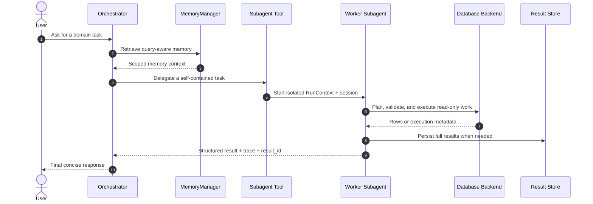

# AgentWeave

English | [中文](README.zh-CN.md)

AgentWeave is a composable agent runtime built with Streamlit and the OpenAI Agents SDK. It separates a lightweight Orchestrator from delegated worker subagents, so specialized workflows can run in isolated contexts while the main agent stays focused on routing, memory, and final response synthesis.

Text2SQL is the first included worker subagent, but the framework is intended to grow beyond database Q&A into broader agentic workflows.

## Why AgentWeave

- **Orchestrator + worker isolation**: keep noisy domain work out of the main conversation state.
- **Manifest-driven extension**: discover subagents from `AGENT.md` and skills from `SKILL.md`.
- **Scoped tools**: the Orchestrator sees only high-level subagent tools; each worker owns its local tools.
- **Memory-aware runtime**: durable memory, session summaries, todo working memory, and optional embedding retrieval.
- **Result isolation**: large query results are stored in SQLite and represented to models as pointers plus samples.
- **Diagnostics first**: model calls, events, memory retrieval, subagent traces, and result previews are inspectable.

## Architecture



## Core Concepts

| Concept | Purpose |
|---|---|
| Orchestrator | Routes user requests, loads memory/skills when needed, delegates specialized work, and summarizes results. |
| Subagent | A worker agent declared by `subagents/*/AGENT.md`; runs in an isolated context with its own tools. |
| Skill | A reusable method card declared by `skills/*/SKILL.md`; loaded as guidance, not exposed as an executable agent. |
| Memory | SQLite-backed durable memory with vector, lexical, and recent-record retrieval strategies. |
| Result Store | SQLite-backed storage for large outputs; models receive `result_id`, row counts, and samples. |
| Diagnostics | Strictly structured run logs for model calls, events, memory retrieval, subagent traces, and result metadata. |

## Included Capabilities

| Type | Name | Description |
|---|---|---|
| subagent | `text2sql` | Natural-language querying over structured data with read-only SQL validation. |
| skill | `data_analysis` | A method card for profiling data, checking quality signals, and suggesting analysis/report structure. |

## Repository Layout

```text
agentweave/
├── app.py                         # Streamlit entrypoint
├── agent_runtime/                 # Orchestrator, memory, diagnostics, registry, stores
├── subagents/
│   └── text2sql/                  # Text2SQL worker subagent
├── skills/
│   └── data_analysis/             # Loadable data analysis method card
├── docs/
│   └── architecture/              # Current architecture docs
├── data/                          # Local private data directory, ignored by git
├── tests/                         # Regression tests
└── .env.example                   # OpenAI-compatible runtime configuration template
```

## Documentation

- [Architecture docs](docs/architecture/)

## Configuration

Copy `.env.example` to `.env` and fill in your own OpenAI-compatible endpoints:

```bash
cp .env.example .env
```

Important environment variables:

| Role | Variables | Default |
|---|---|---|
| Orchestrator | `QWEN36_BASE_URL` / `QWEN36_MODEL` | `http://localhost:8000/v1` / `openai-compatible-chat-model` |
| SQL generation | `QWEN32_BASE_URL` / `QWEN32_MODEL` | `http://localhost:8001/v1` / `openai-compatible-sql-model` |
| Embedding memory | `EMBEDDING_BASE_URL` / `EMBEDDING_MODEL` | `http://localhost:8002/v1` / `openai-compatible-embedding-model` |
| Data backend | `TEXT2SQL_BACKEND` | `csv` |
| CSV table mapping | `TEXT2SQL_TABLES_JSON` | See `.env.example` |

Private CSV, SQLite, and runtime database files are intentionally ignored by git. Place local data under `data/` and configure table mappings through environment variables.

## Run

```bash
uv sync
uv run streamlit run app.py
```

Without `uv`:

```bash
./.venv/bin/streamlit run app.py
```

## Test

```bash
./.venv/bin/python -m pytest
```

## Adding a Subagent

1. Create a directory under `subagents/`.
2. Add an `AGENT.md` manifest with `name`, `description`, `execution`, `tools`, `memory`, and `routing_hints`.
3. Implement the tool module referenced by `execution.tool_module`.
4. Optionally provide `execution.context_module` to inject dynamic prompt context.

## Adding a Skill

1. Create a directory under `skills/`.
2. Add a `SKILL.md` manifest with `name`, `description`, and `activation_hints`.
3. Write the method card body as Markdown.

Skills are loaded as guidance via `load_skill`; they are not executable worker agents.

## Data Safety

This public repository intentionally excludes:

- private datasets
- `.env` files
- SQLite runtime databases
- model endpoint details
- result-store artifacts

Use `.env.example` as the configuration contract and keep private runtime state local.
