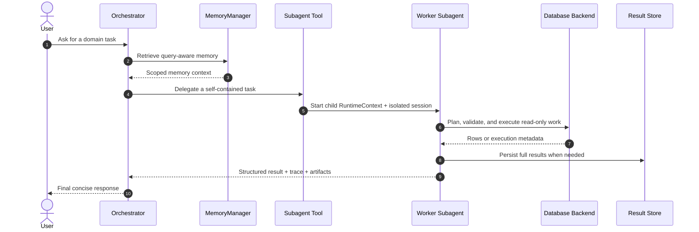

# AgentWeave

English | [中文](README.zh-CN.md)

AgentWeave is a composable agent runtime built with Streamlit and the OpenAI Agents SDK. It separates a lightweight Orchestrator from delegated worker subagents, so specialized workflows can run in isolated contexts while the main agent stays focused on routing, memory, and final response synthesis.

Text2SQL and RAG are included worker subagents. The framework is intended to grow beyond database Q&A into broader agentic workflows.

## Why AgentWeave

- **Orchestrator + worker isolation**: keep noisy domain work out of the main conversation state.
- **Extension protocol**: discover subagents from `AGENT.yaml + prompt.md`, then let each `extension.py` register its own tools and readiness checks.
- **Scoped tools**: the Orchestrator sees only high-level subagent tools; each worker owns its local tools.
- **Memory-aware runtime**: durable memory, session summaries, and optional embedding retrieval.
- **Result isolation**: large query results are stored in SQLite and represented through typed artifacts and result pointers.
- **Diagnostics first**: model calls, events, memory retrieval, subagent traces, and result previews are inspectable.

## Architecture


```mermaid
sequenceDiagram
    autonumber
    actor User
    participant O as Orchestrator
    participant M as MemoryManager
    participant T as Subagent Tool
    participant W as Worker Subagent
    participant DB as Database Backend
    participant RS as Result Store

    User->>O: Ask for a domain task
    O->>M: Retrieve query-aware memory
    M-->>O: Scoped memory context
    O->>T: Delegate a self-contained task
    T->>W: Start child RuntimeContext + isolated session
    W->>DB: Plan, validate, and execute read-only work
    DB-->>W: Rows or execution metadata
    W->>RS: Persist full results when needed
    W-->>O: Structured result + trace + artifacts
    O-->>User: Final concise response
```

## Core Concepts

| Concept | Purpose |
|---|---|
| Orchestrator | Routes user requests, loads memory/skills when needed, delegates specialized work, and summarizes results. |
| Subagent | A worker agent declared by `subagents/*/AGENT.yaml + prompt.md`; runs in an isolated context and owns its extension tools. |
| Extension | A `register(api)` module that registers subagent tools, environment validation, and optional prompt context. |
| Skill | A reusable method card declared by `skills/*/SKILL.md`; loaded as guidance, not exposed as an executable agent. |
| Memory | SQLite-backed durable memory with vector, lexical, and recent-record retrieval strategies. |
| Result Store | SQLite-backed storage for large outputs; workers expose typed artifacts with result pointers, row counts, and samples. |
| Diagnostics | Strictly structured run logs for model calls, events, memory retrieval, subagent traces, and result metadata. |

## Included Capabilities

| Type | Name | Description |
|---|---|---|
| subagent | `text2sql` | Natural-language querying over structured data with read-only SQL validation. |
| subagent | `rag` | Markdown knowledge-base retrieval with cited chunks from local test data. |
| skill | `data_analysis` | A method card for profiling data, checking quality signals, and suggesting analysis/report structure. |

## Repository Layout

```text
agentweave/
├── app.py                         # Streamlit entrypoint
├── agent_runtime/                 # Orchestrator, extension API, memory, registry, stores
├── agentweave_prepare/            # Project-level local environment preparation CLIs
├── subagents/
│   ├── text2sql/                  # Text2SQL manifest, prompt, extension, core logic
│   └── rag/                       # Markdown RAG manifest, prompt, extension, core logic
├── bots/                          # Backend bot configs that scope allowed capabilities
├── skills/
│   └── data_analysis/             # Loadable data analysis method card
├── docs/
│   ├── architecture/              # Current architecture docs
│   ├── environment/               # Project-level setup for databases and indexes
│   └── iterations/                # Design iteration notes
├── data/
│   └── examples/                  # Versioned demo CSV/Markdown inputs for preparation
├── .agentweave/                   # Local runtime state, ignored by git
├── tests/                         # Regression tests
└── .env.example                   # OpenAI-compatible runtime configuration template
```

## Documentation

- [Architecture docs](docs/architecture/)
- [Environment setup](docs/environment/)
- [Iteration notes](docs/iterations/)

## Configuration

Copy `.env.example` to `.env` and fill in your own OpenAI-compatible endpoints:

```bash
cp .env.example .env
```

Runtime loads local env files in this order:

1. `.env` for shared model/server settings.
2. `.agentweave/runtime.env` for optional local overrides.
3. `.agentweave/text2sql.env` for prepared Text2SQL database connection.
4. `.agentweave/rag.env` for local RAG settings.

Important environment variables:

| Role | Variables | Default |
|---|---|---|
| Chat model | `CHAT_BASE_URL` / `CHAT_MODEL` | `http://localhost:8000/v1` / `qwen3.6-27b` |
| Embedding memory | `EMBEDDING_BASE_URL` / `EMBEDDING_MODEL` | `http://localhost:8002/v1` / `openai-compatible-embedding-model` |
| Text2SQL DB | `TEXT2SQL_BACKEND` / `TEXT2SQL_DATABASE_URL` | Generated by `uv run agentweave-prepare-text2sql --overwrite` |
| RAG index | `RAG_INDEX_PATH` | Generated by `uv run agentweave-prepare-rag` |
| Optional todo tool | `AGENTWEAVE_ENABLE_TODO_TOOL` | `0`, session-local todo state is hidden by default |

Private CSV, Markdown, SQLite, and runtime database files are intentionally ignored
by git. Versioned demo inputs live under `data/examples/`; put private local
inputs elsewhere and pass `--csv-root` or `--source-root` to the prepare CLIs.
See [environment setup](docs/environment/).

Local generated state lives under `.agentweave/`, including prepared subagent
env files, prepared SQLite/RAG indexes, memory, result store, and Streamlit
session diagnostics. The directory is runtime-local and should not be committed.

## Run

```bash
uv sync
cp .env.example .env
uv run agentweave-prepare-text2sql --overwrite
uv run agentweave-prepare-rag
uv run streamlit run app.py
```

For the FastAPI HTTP/SSE server:

```bash
uv run agentweave-server
```

## Test

```bash
uv run pytest
```

## Adding a Subagent

1. Create a directory under `subagents/`.
2. Add `AGENT.yaml` with `name`, `description`, `execution.mode: worker`, `extension`, `capabilities`, `policies`, `output_contract`, `memory`, and `routing_hints`. All worker and extension chat calls use the single runtime `CHAT_*` model profile.
3. Add `prompt.md` for the worker prompt.
4. Implement `extension.py` with `register(api)` to register tools, result formatters, capability resolvers, environment checks, and prompt context.
5. Optionally add `core/` for pure domain logic. Project environment preparation, sample data, and offline prepare CLIs stay outside `subagents/`. Tools must be registered from `extension.py register(api)`.

Recommended subagent package shape:

```text
subagents/<name>/
├── AGENT.yaml
├── prompt.md
├── extension.py      # Required: register(api)
└── core/             # Optional pure domain logic
```

Subagents do not need per-subagent framework tests when they follow this
contract. The registry validates the package shape at startup.

### AGENT.yaml Fields

| Field | Required | Meaning |
|---|---|---|
| `name` | Yes | Unique subagent name and delegated tool name. Prefer lowercase snake_case. |
| `description` | Yes | Capability description used for routing, capability listings, and welcome payloads. |
| `execution.mode` | Yes | Use `worker` for subagents. |
| `execution.max_turns` | No | Per-run SDK turn limit; falls back to `WORKER_MAX_TURNS`. |
| `execution.timeout_seconds` | No | Per-run worker timeout; falls back to `WORKER_TIMEOUT_SECONDS`. |
| `extension.module` | Recommended | Python module containing `register(api)` for tools, environment validation, and prompt context. |
| `capabilities` | No | Auditable capability package names owned by the subagent, for example `db.readonly` or `rag.search`. |
| `policies` | No | Capability constraints such as row limits, timeout, allowed schemas, and recursive-call policy. Tools must still enforce security. |
| `output_contract` | No | Declared worker result shape and artifact types, for example `sql_result` or `rag_chunks`. |
| `model.embedding` / `model.embedding_base_url` | No | Manifest-local embedding model/base URL override. |
| `memory.namespaces` | No | Durable memory namespaces available to the worker prompt. |
| `domains.file` | No | Subagent-local domain catalog path, used by Text2SQL. Core passes this through. |
| `routing_hints` | Recommended | Routing phrases that help the Orchestrator choose the subagent. |
| `suggested_questions` | No | Welcome-screen preset questions declared by the subagent. |

Model role fields are removed; worker chat calls use the runtime `CHAT_*` model profile.
`ResultFormatter` mappings belong to the owning subagent extension; core only provides the artifact contract and registry.

## Adding a Skill

1. Create a directory under `skills/`.
2. Add a `SKILL.md` manifest with `name`, `description`, and `activation_hints`.
3. Write the method card body as Markdown.

Skills are loaded as guidance via `load_skill`; they are not executable worker agents.

## Data Safety

This public repository intentionally excludes:

- private datasets
- `.env` files
- SQLite runtime databases
- model endpoint details
- result-store artifacts

Use `.env.example` as the configuration contract and keep private runtime state local.
