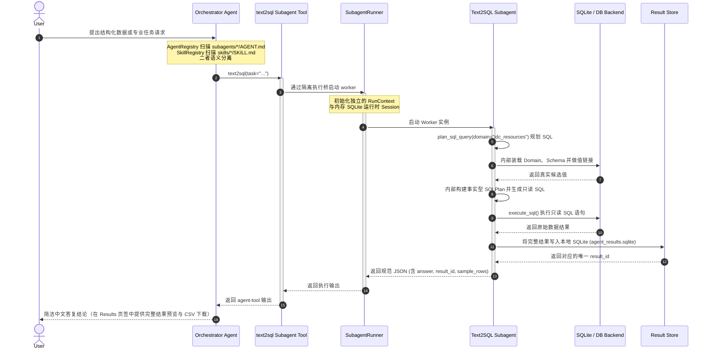

# AgentWeave

[English](README.md) | 中文

## 架构与核心流程

### 1. 流程时序图



### 2. 核心步骤详解

本架构采用 **Orchestrator（主编排器） + Ephemeral Worker（隔离子智能体）** 双层设计，具体执行流如下：

1. **注册与感知阶段（Registry Discovery）**：
   * `AgentRegistry` 只扫描 `subagents/*/AGENT.md`，解析可委派 subagent（如 `text2sql`）。
   * `SkillRegistry` 只扫描 `skills/*/SKILL.md`，解析可加载 skill 方法卡（如 `data_analysis`）。
   * Orchestrator 只把 worker subagent 注入 `<subagents_routing>` 并暴露成同名 agent tool；skill 只进入 `<skills_catalog>`，需要时通过 `load_skill` 读取。

2. **意图路由与委派阶段（Routing & Delegation）**：
   * Orchestrator 接收用户问题，通过路由提示词匹配合适的 subagent。
   * 识别到该能力的 `execution_mode` 为 `isolated subagent`。
   * **调用同名 subagent tool**：Orchestrator 自动生成一份自包含的 `task` 参数，只传用户原文和已确认事实；字段选择、枚举映射和值链接由 Worker 内部完成。

3. **沙箱隔离执行阶段（Subagent Execution）**：
   * SDK agent tool 进入执行桥后，`SubagentRunner` 在隔离内存的 `SQLiteSession` 与 `RunContext` 下动态实例化一个 Worker Subagent。
   * Worker 根据 `AGENT.md` 设定的专家行为规范，默认只调用高层工具（`plan_sql_query` -> `execute_sql`）完成数据查询；Domain 激活、Schema 装载、值链接、事实型 SQLPlan 和 SQL 生成在后端脚本中完成并保留 trace。
   * **值链接**：对于用户输入中拼写不精确的实体，`plan_sql_query` 会在内部查询数据库真实值候选，帮助 SQL 模型生成更 grounded 的 SQL。
   * **异常重试**：如 SQL 执行报错，Worker 会结合报错信息重新生成并执行最多一次。

4. **结果持久化与展现阶段（Result Persistence & UI）**：
   * 数据库只读执行后，`execute_sql` 将完整的百万级数据写入本地 `agent_results.sqlite` 的 Result Store。
   * Worker 只携带极简的 `result_id`、总行数 `row_count` 以及前几行的样例数据 `sample_rows` 返回给 Orchestrator，防止主模型上下文溢出。
   * Orchestrator 提取关键结论，以简洁的中文呈现给用户；前端 Streamlit 接收 `result_id`，在 "Results" 页签下进行分页数据展示及提供 CSV 导出下载。

## 运行时机制与扩展

### 1. Worker 运行模式（Execution Modes）
在 subagent 配置文件 `AGENT.md` 中，可以通过 `execution.mode` 配置运行时的载入行为：
*   **Worker 模式 (Subagent Mode)**:
    *   **配置值**: `mode: worker`
    *   **行为**: subagent 运行在完全独立的沙箱容器（`SQLiteSession`）中，作为一个自治的 Worker Agent 运行多步推理逻辑。主编排器（Orchestrator）通过 SDK agent-as-tool 风格的同名工具进行委派，Worker 内部调用自己局部的 Tools 完成工作后返回统一格式的 JSON 结果。
    *   **接入方式**: 通过 `AGENT.md` 的 `execution.tool_module`、`execution.context_module`、`execution.model_role` 声明运行时模块；无需改 Orchestrator 或注册表常量。
    *   **适用场景**: 需要大模型进行复杂的垂直推理、多步骤操作、容错纠错的场景（如 SQL 纠错、网页深度爬取等）。

### 2. Skill 方法卡（Skills）

`skills/` 只存放真正的 skill 方法卡或可复用工作流说明，不承载 worker subagent 代码。Orchestrator 会把 `skills/*/SKILL.md` 的摘要注入 `<skills_catalog>`，但不会把它们暴露成同名工具。

当前接入的 `data_analysis` skill 借鉴 DB-GPT 的数据分析 skill 思路：先做数据画像，再检查质量信号、异常值、分布/排行，最后给出图表建议和报告结构。需要使用时，Orchestrator 调用 `load_skill("data_analysis")` 读取完整方法卡，再将步骤用于当前回答或写入 subagent task。

### 3. 记忆系统（Memory System）
系统提供基于 SQLite 存储（`agent_memory.sqlite`）的持久化与会话记忆，由 `MemoryManager` 统一调度。长期记忆优先通过 Embedding 向量检索注入，失败时退回词法检索或最近记录；Streamlit 侧栏可关闭 Memory 能力，或直接清空记忆库中的记忆记录、会话摘要和向量索引。作用域如下：
*   **长期记忆 (Durable Memory)**:
    *   `project` 命名空间：存储跨会话的项目级别约定、口径与数据映射规则。
    *   `user` 命名空间：存储用户个性化偏好。
*   **会话续航记忆 (Session Continuity)**:
    *   `session:<session_id>` 命名空间：会话轮次过多触发上下文压缩（Soft Summary）时，`ContextCompressor` 提炼的阶段性工作成果将保存在此，用于后续会话续航。
*   **短期会话工作记忆 (Todo List)**:
    *   通过 `update_todo` 工具动态更新，仅在当前会话生命周期内有效（不持久化）。编排器用其来做多步骤规划与自我进度追踪。

### 4. 钩子机制（Hooks）
框架支持事件驱动的钩子扩展（`HookRunner`），目前已启用的核心钩子为：
*   **`SessionStart` 钩子**:
    *   **触发时机**: 新会话首次启动时。
    *   **行为**: 动态分析当前已加载的数据域（Domains），调用 LLM 针对性地生成包含业务特征的“首页预设样本问题”（Preset Questions），并整合项目历史记忆，呈现高度定制化的欢迎消息。

## 已接入的能力

| 类型 | 名称 | 说明 |
|------|------|------|
| subagent | `text2sql` | 使用自然语言查询结构化数据 |
| skill | `data_analysis` | 数据画像、质量检查、异常发现、图表建议的方法卡 |

## 详细文档

`docs/` 按用途拆分为两类：

- `docs/architecture/`：当前架构说明，包括 Orchestrator、Memory、Tools、Skill、Text2SQL Subagent 和 Todo。
- `docs/iterations/`：迭代与审查记录，包括从纯工具式 Text2SQL 演进到 Subagent + Memory 架构的对比说明。

## 项目结构

```
text2sql/
├── app.py                         # Streamlit 入口
├── agent_runtime/
│   ├── orchestrator.py            # 主 Orchestrator runtime
│   ├── skill_runner.py            # SubagentRunner worker 生命周期
│   ├── skill_registry.py          # AgentRegistry + SkillRegistry
│   ├── common.py                  # 通用 helper：时间、XML、frontmatter、identifier 等
│   ├── result_store.py            # SQLite query result store
│   ├── diagnostic_store.py        # 诊断日志持久化
│   ├── memory_manager.py          # memory/todo 上层协调
│   ├── memory_store.py            # SQLite memory store
│   ├── embeddings.py              # OpenAI-compatible embedding client
│   ├── token_counter.py           # 可插拔 token budget 计数器
│   ├── compressor.py              # 上下文压缩与 hard trim
│   ├── hooks.py                   # SessionStart hook
│   ├── model_profiles.py          # 模型角色配置
│   ├── settings.py                # 环境变量配置读取
│   ├── database.py                # 只读数据库后端
│   ├── preset_questions.py        # 首页预设问题生成
│   └── runtime_utils.py           # 模型日志、SQL 提取、时间工具
├── subagents/
│   └── text2sql/
│       ├── AGENT.md               # subagent manifest frontmatter + worker prompt body
│       ├── tools.py               # Text2SQL subagent-local tools
│       ├── planning.py            # SQLPlan / schema selection / validation helpers
│       ├── domain_registry.py     # Text2SQL domain metadata loader
│       ├── prompts.py             # Text2SQL internal prompts
│       └── domains/               # Text2SQL table/domain configs
│           ├── idc_resources/DOMAIN.md
│           └── sea_cable_faults/DOMAIN.md
├── skills/
│   └── data_analysis/
│       └── SKILL.md               # loadable data-analysis method card
├── docs/
│   ├── architecture/              # 当前架构说明
│   └── iterations/                # 迭代与审查记录
└── data/
    └── README.md                  # 本地私有数据目录，真实数据不提交
```

## 新增 Subagent

新增通用 subagent：

1. 在 `subagents/` 下创建新目录，例如 `subagents/my_agent/`。
2. 创建 `AGENT.md`，用 YAML frontmatter 声明 `name`、`description`、`execution`、`tools`、`memory` 和 `routing_hints`，markdown body 作为 worker prompt 模板。
3. 在 subagent 目录中实现 tools 模块，并通过 `execution.tool_module` 指向该 Python 模块；如果 prompt 需要动态上下文，通过 `execution.context_module` 暴露 `build_prompt_context(manifest)`。
4. 可通过环境变量关闭某个 subagent 的 tools，例如 `SUBAGENT_TEXT2SQL_ENABLED=0`。

最小 worker subagent manifest 示例：

```yaml
---
name: my_agent
description: 处理某类专业任务。
execution:
  mode: worker
  model_role: orchestrator
  tool_module: subagents.my_agent.tools
  context_module: subagents.my_agent.context
  max_turns: 8
  timeout_seconds: 60
tools:
  - first_tool
routing_hints:
  - 何时路由到这个 subagent
---

你是 my_agent subagent。只完成 Orchestrator 交给你的 task，并返回结构化结果。
```

## 新增 Skill

新增 skill，也就是给 Orchestrator 或 subagent 提供一张可加载的方法卡：

1. 在 `skills/` 下创建新目录，例如 `skills/my_skill/`。
2. 创建 `SKILL.md`，用 YAML frontmatter 声明 `name`、`description`、`activation_hints` 和可选 `memory`。
3. Markdown body 写清楚适用场景、步骤、输出契约和注意事项。
4. skill 不会自动变成同名工具；Orchestrator 需要通过 `load_skill("my_skill")` 读取后应用。

最小 skill 示例：

```yaml
---
name: my_skill
description: 某类任务的方法卡。
activation_hints:
  - 何时加载这个 skill
---

# My Skill

## Workflow
1. ...
```

## 新增数据领域

新增 Text2SQL domain，也就是给 Text2SQL subagent 增加一个可查询 SQL 表：

1. 在 `subagents/text2sql/domains/` 下创建新目录，例如 `subagents/text2sql/domains/my_new_domain/`
2. 创建 `DOMAIN.md`，定义 YAML frontmatter：

```yaml
---
name: my_new_domain
description: 回答关于 XXX 的数据问题。
table: my_table
text_fields:
  - field_a
  - field_b
field_descriptions:
  field_a: 字段 A 的中文描述
  field_b: 字段 B 的中文描述
---

# My New Domain

## Workflow
1. ...
```

3. 准备对应数据表。
4. 如果使用 CSV demo 后端，通过 `TEXT2SQL_TABLES_JSON` 添加表名到 CSV 文件的映射。

```bash
export TEXT2SQL_TABLES_JSON='{
  "resources": "data/resources.csv",
  "sea_cable_faults": "data/sea_cable_faults.csv",
  "my_table": "data/my_data.csv"
}'
```

## 启动

```bash
uv sync
uv run streamlit run app.py
```

如果本地没有 `uv`，也可以使用项目虚拟环境：

```bash
./.venv/bin/streamlit run app.py
```

## 数据后端配置

默认使用 CSV 后端，会把 `TEXT2SQL_TABLES_JSON` 配置的本地 CSV 文件加载进内存 SQLite，并自动推断字段类型。真实数据文件不进入 Git；可参考 `.env.example` 配置自己的表映射。

也可以通过环境变量连接 SQLite 数据库文件：

```bash
export TEXT2SQL_BACKEND=sqlite
export TEXT2SQL_DATABASE_URL='sqlite:////absolute/path/to/database.db'
uv run streamlit run app.py
```

后端统一执行只读 SQL：仅允许单条 `SELECT` 或只读 `WITH` 查询，禁止写入、DDL、`PRAGMA`、`ATTACH` 等危险语句。

## 查询结果存储

`execute_sql()` 不再把完整查询结果塞进 worker 上下文，而是写入本地 SQLite `agent_results.sqlite`。Worker 只看到：

- `result_id`
- `row_count`
- `columns`
- `sample_rows`
- `sample_size`
- `truncated`

Streamlit 的 `Results` 页签会根据 `result_id` 从 Result Store 分页读取完整结果，并提供 CSV 下载。

可调环境变量：

```bash
export SQL_RESULT_SAMPLE_ROWS=50       # 返回给模型的样例行数
export SQL_RESULT_STORE_MAX_ROWS=1000  # 单次查询最多写入 Result Store 的行数
export SQL_RESULT_CELL_MAX_CHARS=300   # 样例中单元格文本预览长度
export SQL_RESULT_TTL_HOURS=24         # 可选：写入新结果时清理超过 TTL 的历史结果
```

## 诊断日志

Streamlit 每次用户提问都会把完整诊断 run 写入 `.streamlit_agent_sessions.sqlite`。诊断字段只使用规范化字段写入；缺时间、usage 或 request 时会记录 `diagnostic_issue`，不会从 raw JSON 反推。

- `agent_run_logs`：一轮用户问题、最终回答、状态、耗时、token 汇总、trace summary。
- `agent_run_model_calls`：每次模型调用的规范时间、耗时、token、消息数、工具数、诊断问题和 raw payload。
- `agent_run_events`：Skill、Subagent、Memory、Todo、SQL 执行等事件流；事件时间只来自顶层 `timestamp`。

常用查询：

```bash
sqlite3 .streamlit_agent_sessions.sqlite \
  "select run_id, session_id, status, duration_ms, total_tokens, substr(question,1,60), completed_at from agent_run_logs order by completed_at desc limit 10"

sqlite3 .streamlit_agent_sessions.sqlite \
  "select call_index, title, model, duration_ms, total_tokens, diagnostic_issue, created_at from agent_run_model_calls where run_id='<run_id>' order by call_index"

sqlite3 .streamlit_agent_sessions.sqlite \
  "select event_index, kind, stage, diagnostic_issue, created_at from agent_run_events where run_id='<run_id>' order by event_index"
```

## 模型配置

| 角色 | 环境变量 | 默认值 |
|------|----------|--------|
| Orchestrator | `QWEN36_BASE_URL` / `QWEN36_MODEL` | `http://localhost:8000/v1` / `openai-compatible-chat-model` |
| Orchestrator context window | `QWEN36_CONTEXT_WINDOW` | `32768` |
| Worker subagent 编排 | `SUBAGENT_<NAME>_MODEL_ROLE` | `execution.model_role` |
| Text2SQL worker 编排 | `TEXT2SQL_WORKER_MODEL_ROLE` | `orchestrator` |
| SQL 生成 / 上下文压缩 | `QWEN32_BASE_URL` / `QWEN32_MODEL` | `http://localhost:8001/v1` / `openai-compatible-sql-model` |
| SQL/context window | `QWEN32_CONTEXT_WINDOW` | `32768` |
| Memory embedding | `EMBEDDING_BASE_URL` / `EMBEDDING_MODEL` | `http://localhost:8002/v1` / `openai-compatible-embedding-model` |
| Vision 预留 | `QWEN_VL_BASE_URL` / `QWEN_VL_MODEL` | `http://localhost:8003/v1` / `openai-compatible-vision-model` |

其他运行时配置：

```bash
export WORKER_MAX_TURNS=15
export SUBAGENT_TEXT2SQL_MAX_TURNS=15
export SUBAGENT_TEXT2SQL_TIMEOUT_SECONDS=120
export OPENAI_CLIENT_TIMEOUT=60
export OPENAI_CLIENT_MAX_RETRIES=2
export MEMORY_ENABLED=1
export MEMORY_EMBEDDING_ENABLED=1
export TEXT2SQL_TIMEZONE='Asia/Hong_Kong'
```
