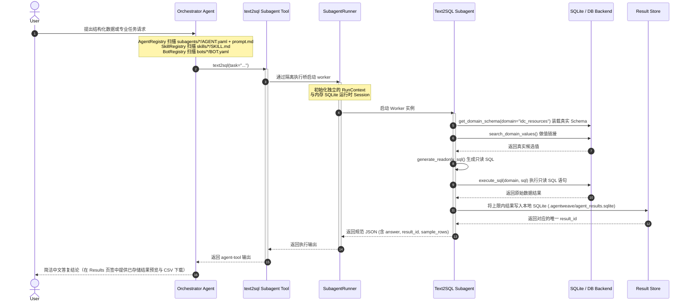

# AgentWeave

[English](README.md) | 中文

## 架构与核心流程

### 1. 流程时序图


```mermaid
sequenceDiagram
    autonumber
    actor User
    participant Orchestrator as Orchestrator Agent
    participant AgentTool as text2sql Subagent Tool
    participant Runner as SubagentRunner
    participant Worker as Text2SQL Subagent
    participant DB as SQLite / DB Backend
    participant Store as Result Store

    User->>Orchestrator: 提出结构化数据或专业任务请求
    Note over Orchestrator: AgentRegistry 扫描 subagents/*/AGENT.yaml + prompt.md<br/>SkillRegistry 扫描 skills/*/SKILL.md<br/>BotRegistry 扫描 bots/*/BOT.yaml
    Orchestrator->>AgentTool: text2sql(task="...")
    activate AgentTool
    AgentTool->>Runner: 通过隔离执行桥启动 worker
    activate Runner
    Note over Runner: 初始化独立的 RunContext<br/>与内存 SQLite 运行时 Session
    Runner->>Worker: 启动 Worker 实例
    activate Worker

    Worker->>DB: get_domain_schema(domain="idc_resources") 装载真实 Schema
    Worker->>DB: search_domain_values() 做值链接
    DB-->>Worker: 返回真实候选值
    Worker->>Worker: generate_readonly_sql() 生成只读 SQL
    Worker->>DB: execute_sql(domain, sql) 执行只读 SQL 语句
    DB-->>Worker: 返回原始数据结果
    Worker->>Store: 将上限内结果写入本地 SQLite (.agentweave/agent_results.sqlite)
    Store-->>Worker: 返回对应的唯一 result_id
    Worker-->>Runner: 返回规范 JSON (含 answer, result_id, sample_rows)
    deactivate Worker
    Runner-->>AgentTool: 返回执行输出
    deactivate Runner
    AgentTool-->>Orchestrator: 返回 agent-tool 输出
    deactivate AgentTool
    Orchestrator-->>User: 简洁中文答复结论（在 Results 页签中提供已存储结果预览与 CSV 下载）
```

### 2. 核心步骤详解

本架构采用 **Orchestrator（主编排器） + Ephemeral Worker（隔离子智能体）** 双层设计，具体执行流如下：

1. **注册与感知阶段（Registry Discovery）**：
   * `AgentRegistry` 只扫描符合固定格式的 `subagents/*/AGENT.yaml + prompt.md`，解析可委派 subagent（如 `text2sql`、`rag`）。
   * `SkillRegistry` 只扫描 `skills/*/SKILL.md`，解析可加载 skill 方法卡（如 `data_analysis`）。
   * Orchestrator 只把 worker subagent 注入 `<subagents_routing>` 并暴露成同名 agent tool；skill 只进入 `<skills_catalog>`，需要时通过 `load_skill` 读取。

2. **意图路由与委派阶段（Routing & Delegation）**：
   * Orchestrator 接收用户问题，通过路由提示词匹配合适的 subagent。
   * 识别到该能力的 `execution_mode` 为 `isolated subagent`。
   * **调用同名 subagent tool**：Orchestrator 自动生成一份自包含的 `task` 参数，只传用户原文和已确认事实；字段选择、枚举映射和值链接由 Worker 内部完成。

3. **沙箱隔离执行阶段（Subagent Execution）**：
   * SDK agent tool 进入执行桥后，`SubagentRunner` 在隔离内存的 `SQLiteSession` 与 `RunContext` 下动态实例化一个 Worker Subagent。
   * Worker 根据 `prompt.md` 设定的专家行为规范，只调用自己声明的局部 tools。Text2SQL 的 Domain 选择、Schema 装载、值链接和 SQL 生成在 Text2SQL 包内完成；RAG 的 Markdown 分段、索引初始化和检索也在 RAG 包内完成。
   * **值链接**：对于用户输入中拼写不精确的实体，`search_domain_values` 会查询数据库真实值候选，帮助 SQL 模型生成更 grounded 的 SQL。
   * **异常重试**：如 SQL 执行报错，Worker 会结合报错信息重新生成并执行最多一次。

4. **结果持久化与展现阶段（Result Persistence & UI）**：
   * 数据库只读执行后，`execute_sql` 将上限内的查询结果写入本地 `.agentweave/agent_results.sqlite` 的 Result Store。
   * Worker 只携带极简的 `result_id`、`stored_row_count`、`has_more` 以及前几行的样例数据 `sample_rows` 返回给 Orchestrator，防止主模型上下文溢出。
   * Orchestrator 提取关键结论，以简洁的中文呈现给用户；前端 Streamlit 接收 `result_id`，在 "Results" 页签下进行分页数据展示及提供 CSV 导出下载。

## 运行时机制与扩展

### 1. Worker 运行模式（Execution Modes）
在 subagent 配置文件 `AGENT.yaml` 中，可以通过 `execution.mode` 配置运行时的载入行为：
*   **Worker 模式 (Subagent Mode)**:
    *   **配置值**: `mode: worker`
    *   **行为**: subagent 运行在完全独立的沙箱容器（`SQLiteSession`）中，作为一个自治的 Worker Agent 运行多步推理逻辑。主编排器（Orchestrator）通过 SDK agent-as-tool 风格的同名工具进行委派，Worker 内部调用自己局部的 Tools 完成工作后返回统一格式的 JSON 结果。
    *   **接入方式**: 通过 `extension.module` 加载 subagent 自己的 `extension.py register(api)`；扩展自行注册工具、环境检查和 prompt context。`tools.py` 只作为显式声明的自定义补充工具入口。
    *   **适用场景**: 需要大模型进行复杂的垂直推理、多步骤操作、容错纠错的场景（如 SQL 纠错、网页深度爬取等）。

### 2. Skill 方法卡（Skills）

`skills/` 只存放真正的 skill 方法卡或可复用工作流说明，不承载 worker subagent 代码。Orchestrator 会把 `skills/*/SKILL.md` 的摘要注入 `<skills_catalog>`，但不会把它们暴露成同名工具。

当前接入的 `data_analysis` skill 借鉴 DB-GPT 的数据分析 skill 思路：先做数据画像，再检查质量信号、异常值、分布/排行，最后给出图表建议和报告结构。需要使用时，Orchestrator 调用 `load_skill("data_analysis")` 读取完整方法卡，再将步骤用于当前回答或写入 subagent task。

### 3. 记忆系统（Memory System）
系统提供基于 SQLite 存储（`.agentweave/agent_memory.sqlite`）的持久化与会话记忆，由 `MemoryManager` 统一调度。长期记忆优先通过 Embedding 向量检索注入，失败时退回词法检索或最近记录；Streamlit 侧栏可关闭 Memory 能力，或直接清空记忆库中的记忆记录、会话摘要和向量索引。作用域如下：
*   **长期记忆 (Durable Memory)**:
    *   `project` 命名空间：存储跨会话的项目级别约定、口径与数据映射规则。
    *   `user` 命名空间：存储用户个性化偏好。
*   **会话续航记忆 (Session Continuity)**:
    *   `session:<session_id>` 命名空间：会话轮次过多触发上下文压缩（Soft Summary）时，`ContextCompressor` 提炼的阶段性工作成果将保存在此，用于后续会话续航。
*   **短期会话工作记忆 (Todo List)**:
    *   通过 `update_todo` 工具动态更新，仅在当前会话生命周期内有效（不持久化）。编排器用其来做多步骤规划与自我进度追踪。

### 4. 钩子机制（Hooks）
框架支持事件驱动的钩子扩展（`HookRunner`）。`agent_runtime/core/hooks.py` 只保留“事件名 -> 一组处理函数”的核心机制，项目自定义 hook 实现放在 `agent_runtime/hooks/`。当前支持：
*   **`SessionStart`**：新会话启动时由 `agent_runtime/hooks/session_start.py` 返回欢迎消息。Bot 可配置 `welcome.preset: true`，用 `welcome.prompt` 加已挂载 subagents/skills 的 description 生成欢迎词；未开启时直接展示欢迎文案和能力描述。
*   **`PreToolUse` / `PostToolUse`**：每次工具或 subagent tool 调用前后触发，可用于只读校验、审计、阻止调用或向模型返回 hook 注入信息。

## 已接入的能力

| 类型 | 名称 | 说明 |
|------|------|------|
| bot | `data_analyst` | 挂载 `text2sql`、`rag` 与 `data_analysis` 的数据分析机器人 |
| subagent | `text2sql` | 使用自然语言查询结构化数据 |
| subagent | `rag` | 基于本地 Markdown 知识库检索并返回来源片段 |
| skill | `data_analysis` | 数据画像、质量检查、异常发现、图表建议的方法卡 |

## 详细文档

`docs/architecture/` 存放当前稳定架构说明，`docs/iterations/` 记录重要迭代过程和设计取舍。

## 项目结构

```
agentweave/
├── app.py                         # Streamlit 入口
├── agent_runtime/
│   ├── common.py                  # 通用 helper：时间、XML、frontmatter、identifier 等
│   ├── core/
│   │   ├── orchestrator.py        # 主 Orchestrator runtime
│   │   ├── subagent_runner.py     # SubagentRunner worker 生命周期
│   │   ├── skill_runner.py        # 兼容旧导入的 shim
│   │   ├── context.py             # BaseContext / OrchestratorContext / RunContext
│   │   ├── events.py              # RuntimeEvent / EventBus
│   │   ├── hooks.py               # HookResult/HookRunner 等核心 hook 机制
│   │   ├── result_events.py       # 从事件流提取 ResultStore metadata
│   │   ├── compressor.py          # 上下文压缩与 hard trim
│   │   ├── model_profiles.py      # 模型角色配置
│   │   ├── settings.py            # 环境变量配置读取
│   │   └── runtime_utils.py       # 模型日志、SQL 提取、时间工具
│   ├── hooks/                     # AgentWeave 自定义 hook 实现
│   │   └── session_start.py       # SessionStart welcome hook
│   ├── memory/                    # memory/todo/session summary/embedding
│   ├── storage/                   # database/result/diagnostic store
│   ├── registry/                  # manifest discovery / resource loader
│   ├── server/                    # HTTP/SSE backend API
│   └── ui/streamlit/              # Streamlit rendering and session actions
├── subagents/
│   ├── text2sql/
│   │   ├── AGENT.yaml             # subagent 能力元数据、extension/tools 声明
│   │   ├── prompt.md              # worker prompt 模板
│   │   ├── extension.py           # Text2SQL extension 注册入口
│   │   ├── ENVIRONMENT.md         # Text2SQL 本地/生产环境启动说明
│   │   ├── data/                  # Text2SQL 私有本地 CSV 测试数据
│   │   ├── domain_catalog.yaml    # Text2SQL table/domain catalog
│   │   ├── core/                  # domain catalog / SQL generation / SQL safety
│   │   └── prepare/               # SQLite 构建等离线准备脚本
│   └── rag/
│       ├── AGENT.yaml             # RAG 能力元数据、extension 声明
│       ├── prompt.md              # RAG worker prompt 模板
│       ├── extension.py           # RAG extension 注册入口
│       ├── ENVIRONMENT.md         # RAG Markdown index 本地环境启动说明
│       ├── data/                  # RAG 私有本地 Markdown 测试数据
│       ├── core/                  # Markdown loader / retrieval / index data structure
│       └── prepare/               # RAG index 离线构建脚本
├── bots/
│   └── data_analyst/
│       └── BOT.yaml               # 后端 Bot 配置：挂载能力与欢迎文案
├── skills/
│   └── data_analysis/
│       └── SKILL.md               # loadable data-analysis method card
├── docs/
│   ├── architecture/              # 当前架构说明
│   └── iterations/                # 架构迭代记录
├── data/
│   └── README.md                  # 全局临时数据目录
└── .agentweave/                   # 本地运行态数据，git ignore
```

## 新增 Subagent

新增通用 subagent：

1. 在 `subagents/` 下创建新目录，例如 `subagents/my_agent/`。
2. 创建 `AGENT.yaml`，声明 `name`、`description`、`execution`、`extension`、`memory`、可选 `tools` 和 `routing_hints`。
3. 创建 `prompt.md`，作为 worker prompt 模板。
4. 在 subagent 目录中实现 `extension.py`，暴露 `register(api)`；通过 `api.tool(...)`、`api.validate_environment(...)`、`api.prompt_context(...)` 注册能力。
5. 如果需要自定义补充工具，可新增 `tools.py` 并在 `AGENT.yaml.tools` 中显式声明工具名。
6. 如果需要本地准备流程，提供 `ENVIRONMENT.md`、`data/`、`core/` 和 `prepare/`。框架只执行 extension 注册协议，不理解 SQL、Markdown、向量库等业务细节。
7. 可通过环境变量关闭某个 subagent 的 tools，例如 `SUBAGENT_TEXT2SQL_ENABLED=0`。

新增 subagent 只要符合这个 contract，不需要给框架新增专属测试；registry 启动时会校验目录形状。不符合格式就直接报配置错误。

推荐目录结构：

```text
subagents/<name>/
├── AGENT.yaml
├── prompt.md
├── extension.py      # 必需，register(api)
├── tools.py          # 可选，自定义补充工具
├── ENVIRONMENT.md    # 可选，环境准备说明
├── data/             # 可选，本 subagent 私有测试数据
├── core/             # 可选，业务纯逻辑
└── prepare/          # 可选，离线准备脚本
```

最小 worker subagent manifest 示例：

```yaml
name: my_agent
description: 处理某类专业任务。
execution:
  mode: worker
  model_role: orchestrator
  max_turns: 8
  timeout_seconds: 60
extension:
  module: subagents.my_agent.extension
tools:
  - first_tool
routing_hints:
  - 何时路由到这个 subagent
```

## 新增 Skill

新增 skill，也就是给 Orchestrator 或 subagent 提供一张可加载的方法卡：

1. 在 `skills/` 下创建新目录，例如 `skills/my_skill/`。
2. 创建 `SKILL.md`，用 YAML frontmatter 声明 `name`、`description`、`activation_hints` 和可选 `memory`。
3. Markdown body 写清楚适用场景、步骤、输出契约和注意事项。
4. skill 不会自动变成同名工具；Orchestrator 需要通过 `load_skill("my_skill")` 读取后应用。

最小 skill 示例：

```yaml
---
name: my_skill
description: 某类任务的方法卡。
activation_hints:
  - 何时加载这个 skill
---

# My Skill

## Workflow
1. ...
```

## 新增数据领域

新增 Text2SQL domain，也就是给 Text2SQL subagent 增加一个可查询 SQL 表：

1. 在 `subagents/text2sql/domain_catalog.yaml` 的 `domains` 列表中新增一项：

```yaml
domains:
  - name: my_new_domain
    description: 回答关于 XXX 的数据问题。
    table: my_table
    text_fields:
      - field_a
      - field_b
    field_descriptions:
      field_a: 字段 A 的中文描述
      field_b: 字段 B 的中文描述
    notes: |
      这里写业务口径、过滤规则和值链接提示。
```

2. 将本地测试 CSV 放到 `subagents/text2sql/data/`，默认文件名使用 `<table>.csv`，例如 `my_table.csv`。
3. 重新准备本地 SQLite：

```bash
uv run agentweave-prepare-text2sql --overwrite
```

## 启动

本地 Streamlit 调试台：

```bash
uv sync
cp .env.example .env
uv run agentweave-prepare-text2sql --overwrite
uv run agentweave-prepare-rag
uv run streamlit run app.py
```

FastAPI HTTP/SSE 后端服务：

```bash
uv run agentweave-server
```

默认监听 `127.0.0.1:8765`。跨设备访问时在 `.env` 中设置 `AGENTWEAVE_SERVER_HOST=0.0.0.0`，并保留 `AGENTWEAVE_SERVER_TOKEN` 鉴权。

## 数据后端配置

Text2SQL 数据库访问是严格前置流程：runtime 不自动加载 CSV、不自动建库。先运行：

```bash
uv run agentweave-prepare-text2sql --overwrite
```

该命令会根据 `subagents/text2sql/domain_catalog.yaml` 中的 table 名称，读取 `subagents/text2sql/data/<table>.csv`，构建 `.agentweave/text2sql.sqlite`，并生成 `.agentweave/text2sql.env`：

```bash
TEXT2SQL_BACKEND=sqlite
TEXT2SQL_DATABASE_URL=sqlite:////absolute/path/to/.agentweave/text2sql.sqlite
```

启动 Streamlit 或 FastAPI 时会自动加载 `.env` 和 `.agentweave/text2sql.env`。如果要连接真实只读 SQLite 数据库，直接编辑 `.agentweave/text2sql.env` 即可。

后端统一执行只读 SQL：仅允许单条 `SELECT` 或只读 `WITH` 查询，禁止写入、DDL、`PRAGMA`、`ATTACH` 等危险语句。

## 本地运行态目录

`.agentweave/` 统一存放本地生成或运行中的状态文件，不应提交到 git：

- `runtime.env`：本地覆盖配置。
- `text2sql.env` / `rag.env`：prepare 脚本生成的 subagent 环境。
- `text2sql.sqlite`：本地 Text2SQL SQLite 数据库。
- `rag_index.json`：本地 RAG Markdown 索引。
- `agent_memory.sqlite`：长期记忆与向量索引。
- `agent_results.sqlite`：大结果 Result Store。
- `streamlit_sessions.sqlite` / `server_sessions.sqlite`：会话与诊断日志。

## 查询结果存储

`execute_sql()` 不再把完整查询结果塞进 worker 上下文，而是写入本地 SQLite `.agentweave/agent_results.sqlite`。Worker 只看到：

- `result_id`
- `row_count` / `stored_row_count`
- `has_more`
- `columns`
- `sample_rows`
- `sample_size`
- `truncated`

Streamlit 的 `Results` 页签会根据 `result_id` 从 Result Store 分页读取已存储结果，并提供 CSV 下载。

可调环境变量：

```bash
export SQL_RESULT_SAMPLE_ROWS=50       # 返回给模型的样例行数
export SQL_RESULT_STORE_MAX_ROWS=1000  # 单次查询最多写入 Result Store 的行数
export SQL_RESULT_CELL_MAX_CHARS=300   # 样例中单元格文本预览长度
export SQL_RESULT_TTL_HOURS=24         # 可选：写入新结果时清理超过 TTL 的历史结果
```

## 诊断日志

Streamlit 每次用户提问都会把完整诊断 run 写入 `.agentweave/streamlit_sessions.sqlite`。诊断字段只使用规范化字段写入；缺时间、usage 或 request 时会记录 `diagnostic_issue`，不会从 raw JSON 反推。

- `agent_run_logs`：一轮用户问题、最终回答、状态、耗时、token 汇总、trace summary。
- `agent_run_model_calls`：每次模型调用的规范时间、耗时、token、消息数、工具数、诊断问题和 raw payload。
- `agent_run_events`：Skill、Subagent、Memory、Todo、SQL 执行等事件流；事件时间只来自顶层 `timestamp`。

常用查询：

```bash
sqlite3 .agentweave/streamlit_sessions.sqlite \
  "select run_id, session_id, status, duration_ms, total_tokens, substr(question,1,60), completed_at from agent_run_logs order by completed_at desc limit 10"

sqlite3 .agentweave/streamlit_sessions.sqlite \
  "select call_index, title, model, duration_ms, total_tokens, diagnostic_issue, created_at from agent_run_model_calls where run_id='<run_id>' order by call_index"

sqlite3 .agentweave/streamlit_sessions.sqlite \
  "select event_index, kind, stage, diagnostic_issue, created_at from agent_run_events where run_id='<run_id>' order by event_index"
```

## 模型配置

| 角色 | 环境变量 | 默认值 |
|------|----------|--------|
| Orchestrator | `QWEN36_BASE_URL` / `QWEN36_MODEL` | `http://localhost:8000/v1` / `qwen3.6-27b` |
| Orchestrator context window | `QWEN36_CONTEXT_WINDOW` | `32768` |
| Worker subagent 编排 | `SUBAGENT_<NAME>_MODEL_ROLE` | 默认 `orchestrator` |
| 执行类模型 | `EXECUTOR_BASE_URL` / `EXECUTOR_MODEL` | `http://localhost:8001/v1` / `qwen3-32b` |
| Executor context window | `EXECUTOR_CONTEXT_WINDOW` | `32768` |
| Memory embedding | `EMBEDDING_BASE_URL` / `EMBEDDING_MODEL` | `http://localhost:8002/v1` / `openai-compatible-embedding-model` |

其他运行时配置：

```dotenv
WORKER_MAX_TURNS=15
SUBAGENT_TEXT2SQL_MAX_TURNS=15
SUBAGENT_TEXT2SQL_TIMEOUT_SECONDS=120
OPENAI_CLIENT_TIMEOUT=60
OPENAI_CLIENT_MAX_RETRIES=2
MEMORY_ENABLED=1
MEMORY_EMBEDDING_ENABLED=1
TEXT2SQL_TIMEZONE=Asia/Hong_Kong
```

这些变量写入 `.env` 或 `.agentweave/runtime.env` 即可；启动时会自动加载。
