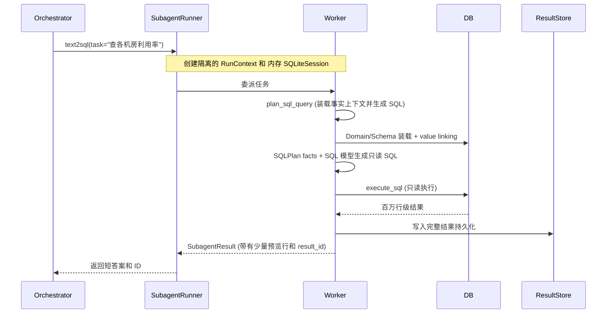

# Text2SQL 子智能体 (Subagent Worker)

> 把探索性工作移进干净的隔离沙箱后，父 Agent 才能持续盯住主目标。

## 概述

**Text2SQL** 是在这个框架下实现的第一个 Worker（干活打工人）。

自然语言转 SQL 是一个极度容易出错、充满噪音的过程。如果把表结构、数据样本、执行报错和疯狂试错的过程全塞进 Orchestrator 的脑子里，Orchestrator 甚至连最开始用户的原始问题都会忘掉。

所以，系统要求 Text2SQL 必须在**完全隔离的沙箱环境**中运行，自己消化所有噪音，最后只向 Orchestrator 汇报精炼的结果。

## 隔离执行架构



## AGENT.md 声明式清单

一切始于声明。`subagents/text2sql/AGENT.md` 是它的身份证：

```yaml
---
name: text2sql
description: 使用自然语言查询结构化数据，支持 SQL 生成、值链接和只读执行。
execution:
  mode: worker
  model_role: orchestrator
  tool_module: subagents.text2sql.tools
  context_module: subagents.text2sql.domain_registry
  max_turns: 8           # 最多给自己试错 8 轮
  timeout_seconds: 120   # 超过 2 分钟直接掐断，提取残骸
tools:
  - get_current_time
  - plan_sql_query
  - execute_sql
memory:
  namespaces: [project, skill:text2sql]
routing_hints:
  - 用户想查询结构化数据
  - 涉及统计、筛选、排行等数据操作
---
```

## SubagentRunner 隔离桥梁

`SubagentRunner` 负责给这个 Worker 建沙箱。核心在于 `run_subagent` 方法：

```python
async def run_subagent(self, subagent_name, task, orchestrator_context):
    # ... 解析配置 ...
    
    # 1. 建立与 Orchestrator 完全不互通的全新 RunContext
    run_ctx = RunContext(
        run_id=f"{subagent_name}-{uuid}",
        backend=orchestrator_context.backend,
        # 它拿不到 Orchestrator 的事件流和消息历史
    )
    
    # 2. 建立临时内存数据库作为 Worker 的脑子
    session = SQLiteSession(run_ctx.run_id, ":memory:")
    
    # 3. 把 Worker 跑起来，带上超时保护
    agent = self.build_worker_agent(manifest, profile)
    try:
        result = await asyncio.wait_for(
            Runner.run(agent, task, context=run_ctx, session=session, max_turns=8),
            timeout=120,
        )
    except asyncio.TimeoutError:
        # 如果超时，从沙箱里抢救一下最后执行过的有效 SQL 结果
        result = self._fallback_result_from_trace(run_ctx.events)
        
    return self._coerce_subagent_result(result)
```

## 内部核心逻辑

进入沙箱后，Worker 的大脑（由 prompt 和工具驱动）开始运转。它必须依赖几个高度特化的组件。

### Domain Registry：动态领域装载

不同的数据表属于不同的业务域。`Text2SQLDomainRegistry` 会扫描 `domains/*/DOMAIN.md`，把相关的字段说明和业务逻辑打包装进 Worker 的 prompt 中。目前支持 `idc_resources` (机房机柜) 和 `sea_cable_faults` (海缆故障)。

### plan_sql_query：装载事实并生成 SQL

Worker 并不直接手写 SQL，而是先调用 `plan_sql_query`。这一步非常重：
1. 激活 Domain，加载表 Schema、字段说明和 `business_metrics`。
2. **值链接（Value Linking）**：比如用户搜“四号机房”，代码会先去真实数据库 `search_values()`，发现该映射到 `"Room-004"`。这极大减少了 SQL 中 `WHERE name = '四号机房'` 这种因为名字不对造成的假死报错。
3. 建立事实型 `SQLPlan`：只放 `question`、`domain`、`table`、`selected_columns`、`selected_schema`、`linked_values`、`business_metrics`、`constraints` 等可追溯事实。
4. 调用更专业的 SQL 模型生成只读 SQL。COUNT、GROUP BY、ORDER BY、LIMIT、展示字段等判断交给 SQL 模型完成，不再由 Python 关键词规则推断。
5. 在这一步，如果模型产生幻觉，生造了不存在的列，会被强硬拦截，绝不允许去碰数据库。

### SQLPlan 的边界

当前 `SQLPlan` 不是“代码版 prompt”，也不负责替模型判断查询意图。它刻意不包含：

- `metric_intent`
- `time_filters`
- `limit`
- `display_intent`
- `confidence`
- `assumptions`

`business_metrics` 来自 `DOMAIN.md`，作为 domain 事实上下文传给 SQL 模型。模型可以据此判断“空闲机柜”“可用机柜”等业务口径是否适用，但代码不会用子串匹配强行注入过滤条件。

### execute_sql 与 结果分离

规划好后，调用 `execute_sql`。这里有一个核心的**结果分离**策略：

如果一个查询跑出了十万行数据，把这些直接抛回给 LLM？那就全崩了。

```python
# 1. 安全校验：哪怕前面拦了，执行前再挡一次所有的 DDL / INSERT 操作
validate_readonly_sql(sql)

# 2. 从数据库拿数据
df = backend.execute_sql(sql)

# 3. 完整结果写进持久化 ResultStore（供前端导出和分页）
result_id = result_store.save(df)

# 4. 只返回给模型和 Orchestrator 一点点“预览”
return {
    "result_id": result_id,
    "row_count": len(df),
    "sample_rows": df.head(10).to_json()  # 给模型瞄一眼验证对错
}
```

## 一句话记住

**Text2SQL Worker 的设计核心是隔离执行 + 事实装载 + 结果分离——系统负责安全边界和可追溯上下文，SQL 判断留给模型，最终只向 Orchestrator 返回整洁的结果指针。**
