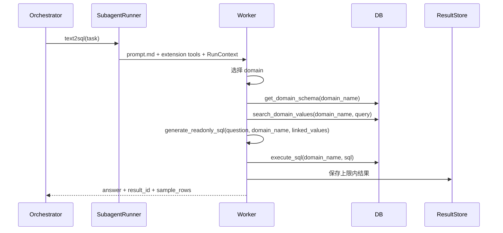

# Text2SQL Subagent

## 概述

Text2SQL 是一个普通 worker subagent。它继承主框架的运行能力：模型配置、Tool 注册、RunContext、事件输出、ResultStore 和 session 隔离；它自己只定义 SQL 查询需要的 prompt、工具、表目录和纯业务逻辑。

主框架不理解 SQL、schema、业务口径或 value linking。框架只把 `text2sql` 当作一个可委派的 worker tool，并提供 run-scoped typed state 容器；Text2SQL 自己定义这块状态里的 domain/table/schema 含义。

## 运行链路


```mermaid
sequenceDiagram
    Orchestrator->>SubagentRunner: text2sql(task)
    SubagentRunner->>Worker: prompt.md + extension tools + RunContext
    Worker->>Worker: 选择 domain
    Worker->>DB: get_domain_schema(domain_name)
    Worker->>DB: search_domain_values(domain_name, query)
    Worker->>Worker: generate_readonly_sql(question, domain_name, linked_values)
    Worker->>DB: execute_sql(domain_name, sql)
    Worker->>ResultStore: 保存上限内结果
    Worker-->>Orchestrator: answer + result_id + sample_rows
```

## 配置

`AGENT.yaml` 只声明 subagent 元数据和 extension 入口：

```yaml
name: text2sql
description: 使用自然语言查询结构化数据，生成并执行只读 SQL。
execution:
  mode: worker
extension:
  module: subagents.text2sql.extension
capabilities:
  - db.readonly
  - schema.inspect
  - sql.generate
policies:
  db:
    readonly: true
    max_rows: 1000
    sample_rows: 50
    require_schema_validation: true
output_contract:
  format: json
  artifact_types:
    - sql_result
domains:
  file: domain_catalog.yaml
```

`domain_catalog.yaml` 是 Text2SQL 私有表目录。它集中描述所有可查询表的 domain 名称、表名、文本字段、字段说明、业务指标和 notes。它不是主框架概念。

## Run State

Text2SQL 使用框架提供的 namespaced typed state 保存本次 worker run 的运行态：

- `backend`：已连接的 SQLite backend。
- `active_domain` / `active_table`：当前激活的数据域和表。
- `active_columns`：从真实数据库读取的当前表字段。
- `active_text_fields` / `active_field_descriptions`：domain catalog 声明的文本字段和字段说明。
- `schema_text`：给 SQL generation prompt 使用的真实 schema 文本。

这些状态由 `Text2SQLRunStateManager` 统一管理。`extension.py` 的 tools 不直接读写裸 `run_ctx.cache["active_*"]` key。

## Schema 加载机制

模型不是自动知道所有 schema。

1. `extension.py` 通过 `api.prompt_context(...)` 从 `domain_catalog.yaml` 注入轻量 `<domains>` 摘要，只包含 domain 名称、描述和表名。
2. worker 模型根据用户问题选择 `domain_name`。
3. worker 必须显式调用 `get_domain_schema(domain_name)`。
4. 工具根据 catalog 找到 table，并从已连接数据库读取真实 schema。
5. 后续 `generate_readonly_sql` 和 `execute_sql` 都按该 domain/table 做字段范围校验。

schema 白名单校验由 `AGENT.yaml` 的 `policies.db.require_schema_validation` 控制，默认开启；不再使用环境变量开关。

## 本地环境边界

Text2SQL runtime 只连接 SQLite，不自动加载 CSV、不自动建库。必须先按 `docs/environment/text2sql.md` 准备数据库。推荐命令是 `uv run agentweave-prepare-text2sql --overwrite`，它默认读取 `data/examples/text2sql/<table>.csv`，离线生成 SQLite，并写入 `.agentweave/text2sql.env`。runtime 启动时自动加载其中的 `TEXT2SQL_BACKEND=sqlite` / `TEXT2SQL_DATABASE_URL`。

未准备数据库时，schema、value linking、SQL 执行相关工具会返回明确环境错误。
