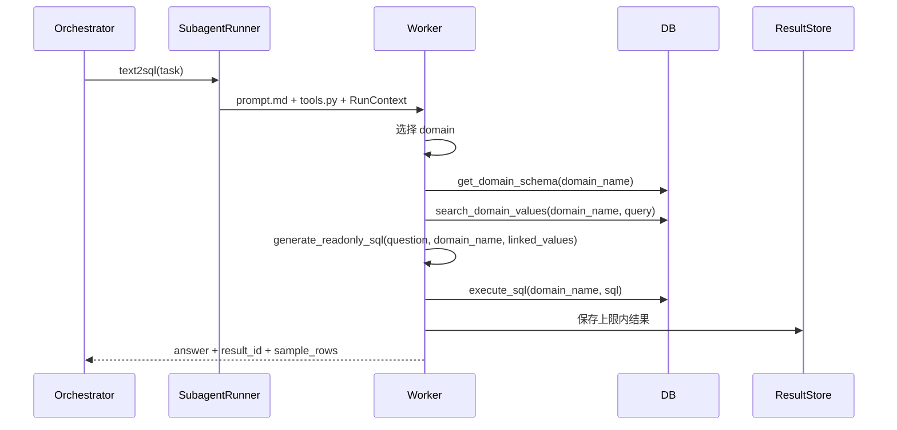

# Text2SQL Subagent

## 概述

Text2SQL 是一个普通 worker subagent。它继承主框架的运行能力：模型配置、Tool 注册、RunContext、事件输出、ResultStore 和 session 隔离；它自己只定义 SQL 查询需要的 prompt、工具、表目录和本地环境说明。

主框架不理解 SQL、CSV、schema、业务口径或 value linking。框架只把 `text2sql` 当作一个可委派的 worker tool。

## 运行链路


```mermaid
sequenceDiagram
    Orchestrator->>SubagentRunner: text2sql(task)
    SubagentRunner->>Worker: prompt.md + tools.py + RunContext
    Worker->>Worker: 选择 domain
    Worker->>DB: get_domain_schema(domain_name)
    Worker->>DB: search_domain_values(domain_name, query)
    Worker->>Worker: generate_readonly_sql(question, domain_name, linked_values)
    Worker->>DB: execute_sql(domain_name, sql)
    Worker->>ResultStore: 保存上限内结果
    Worker-->>Orchestrator: answer + result_id + sample_rows
```

## 配置

`AGENT.yaml` 只声明 subagent 元数据和约定式工具：

```yaml
name: text2sql
description: 使用自然语言查询结构化数据，生成并执行只读 SQL。
execution:
  mode: worker
runtime_env:
  kind: local
  setup_module: subagents.text2sql.env
  mode: manual
tools:
  - get_current_time
  - list_domains
  - get_domain_schema
  - search_domain_values
  - generate_readonly_sql
  - execute_sql
domains:
  file: domain_catalog.yaml
data:
  roots: [subagents/text2sql/data]
  globs: ["*.csv"]
  tables:
    resources: resources.csv
    sea_cable_faults: sea_cable_faults.csv
```

`domain_catalog.yaml` 是 Text2SQL 私有表目录。它集中描述所有可查询表的 domain 名称、表名、文本字段、字段说明、业务指标和 notes。它不是主框架概念。

## Schema 加载机制

模型不是自动知道所有 schema。

1. `context.py` 从 `domain_catalog.yaml` 注入轻量 `<domains>` 摘要，只包含 domain 名称、描述和表名。
2. worker 模型根据用户问题选择 `domain_name`。
3. worker 必须显式调用 `get_domain_schema(domain_name)`。
4. 工具根据 catalog 找到 table，并从已连接数据库读取真实 schema。
5. 后续 `generate_readonly_sql` 和 `execute_sql` 都按该 domain/table 做字段范围校验。

## 本地环境边界

Text2SQL 不自动加载 CSV、不自动建库。必须先按 `subagents/text2sql/ENVIRONMENT.md` 准备数据库。推荐命令是 `uv run agentweave-prepare-text2sql --overwrite`，它会生成 `.agentweave/text2sql.env`，runtime 启动时自动加载其中的 `TEXT2SQL_BACKEND` / `TEXT2SQL_DATABASE_URL`。

未准备数据库时，schema、value linking、SQL 执行相关工具会返回明确环境错误。
