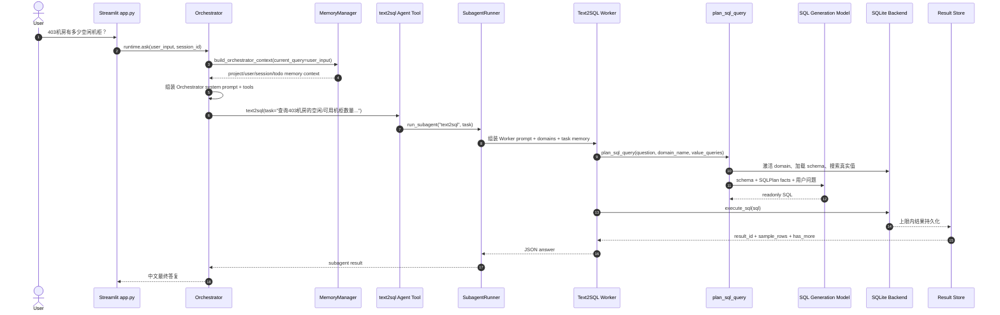

# 403 机房空闲机柜查询调用链与 Prompt 审查

> 内部审查说明：本文针对 IDC 资源场景中「403 机房空闲/可用机柜」这类具体问数问题进行调用链与 prompt 审查。
>
> 该文件位于 `docs/iterations/`，该目录已加入 `.gitignore`，仅用于本地设计复盘和调试，不作为公开仓库文档提交。
>
> 审查样例：用户询问「403 机房有多少空闲机柜？」或「403 机房有多少可用机柜？」
>
> 目标：梳理完整代码调用链、Prompt 组装过程、运行时借用的信息来源，并标出可能存在的过拟合或未显式口径化的推断点。

## 一、总体结论

当前链路已经收敛为较健康的两层结构：

- Orchestrator 负责理解用户意图、选择 `text2sql` subagent、汇总最终答复。
- Text2SQL Worker 只暴露 `plan_sql_query` 和 `execute_sql` 这类高层工具。
- Domain 激活、Schema 装载、Value Linking、SQLPlan 构造、SQL 生成都已下沉到后端脚本中，不再作为细粒度工具逐个暴露给模型。
- 查询结果通过 Result Store 持久化，模型只拿到 `result_id`、`row_count` 和少量 `sample_rows`。

当前状态下，样例问题的重点审查风险是：

- Orchestrator 可能在委派 task 中写入类似 `room_name='403'` 的 schema-like 表达，越过了它应有的职责边界。
- 「空闲 / 可用」到具体字段与枚举值的映射已经进入 `DOMAIN.md` 的 `business_metrics` 事实上下文，但是否采用仍由 SQL 模型判断，需要通过诊断确认。
- 当首次 SQL 返回空结果时，Worker 可能主动扩展查询状态分布；这对诊断有帮助，但可能超过用户原始问题范围。
- SQL 结构判断已经交还给模型；需要关注 SQL prompt 是否保持边界约束，而不是重新引入隐性规则。

## 二、调用链总览



## 三、前端到 Orchestrator

### 1. 用户输入入口

用户输入从 `app.py` 的 chat input 进入：

- `app.py` 读取用户输入。
- 调用 `runtime.ask(prompt, session_id, event_callback, max_turns)`。
- 收集最终输出、model logs 和 events。
- 持久化诊断日志。

### 2. Orchestrator 运行入口

`AgentRuntime.ask()` 位于 `agent_runtime/core/orchestrator.py`：

- 打开当前会话的 `SQLiteSession`。
- 对历史消息做上下文压缩判断。
- 创建 Orchestrator Agent。
- 调用 `_build_instructions(session_id, current_query=user_input, context=context)`。
- 构造 Orchestrator 可见工具。
- 调用 `Runner.run(...)` 执行模型循环。

### 3. Orchestrator Prompt 组装

主 Prompt 从 `agent_runtime/core/prompts.py` 的 `SYSTEM_PROMPT` 开始，再追加运行时上下文。核心组装位置在 `_build_instructions()`。

Orchestrator Prompt 会包含以下信息：

- 主角色边界：专业数据查询默认委派给匹配 subagent，不直接猜内部 schema、SQL 或执行结果。
- 工具策略：相对时间需要先解析；subagent task 应自包含；需要方法卡时才 `load_skill`。
- Memory 策略：当前问题明显依赖项目口径、用户偏好或历史决策时，可以使用 memory。
- Subagent routing：可委派的 subagent 名称、描述、routing hints。
- Skills catalog：可加载的方法卡摘要。
- Project rules：来自 `PROJECT.md`。
- Memory context：当前 query 相关的 project/user 记忆，以及 session summary / todo working memory。

## 四、Orchestrator 可见工具

Orchestrator 的工具面通常包括：

- `get_current_time`
- `load_skill`
- `update_todo`
- memory tools
- subagent tools，例如 `text2sql`

对于「403 机房有多少空闲机柜」这类结构化数据查询，理想行为是：

```text
Orchestrator 只判断这是结构化数据查询，并委派给 text2sql。
不要在 task 中写入自己猜测的字段名、SQL 条件或枚举值。
```

更合适的 task 示例：

```text
查询 403 机房的空闲机柜数量。请在 text2sql 内部选择合适的数据域、字段和值映射，并返回数量、使用的口径和 result_id。
```

不合适的 task 示例：

```text
查询 403 机房（room_name='403'）的可用机柜数量，状态为 "可用"。
```

后者的问题是：`room_name`、状态字段、状态枚举都属于 Text2SQL Worker 内部职责，不应由 Orchestrator 预先编造。

## 五、SubagentRunner 与 Worker Prompt

### 1. SubagentRunner 启动 Worker

Text2SQL Worker 由 `agent_runtime/core/skill_runner.py` 启动：

- 读取 `text2sql` manifest。
- 解析 worker 使用的 model profile。
- 创建隔离的 `RunContext`。
- 构造 worker agent，传入 `prompt_query=task`。
- 使用内存 `SQLiteSession` 执行 `Runner.run(...)`。

Worker 与 Orchestrator 使用隔离的 session，因此 Text2SQL 内部的试错、SQL 报错、schema 细节不会污染主会话。

### 2. Worker Prompt 来源

Worker Prompt 由 `_build_worker_prompt()` 组装，主要来源：

- `subagents/text2sql/AGENT.md`：Worker 行为规范和工具声明。
- `MemoryManager.build_skill_context(manifest, query=task)`：面向当前 task 的 project / skill memory。
- `Text2SQLDomainRegistry.format_for_prompt()`：可用 `<domains>`。
- Orchestrator 传入的 `task`。

当前 `subagents/text2sql/AGENT.md` 中模型可见工具只有：

```yaml
tools:
  - get_current_time
  - plan_sql_query
  - execute_sql
```

这意味着旧的 7 步工具流水线不再暴露给模型，Worker 的默认工作流是：

1. 选择 domain，调用 `plan_sql_query`。
2. 调用 `execute_sql`。
3. 返回严格 JSON。

## 六、Domain 与业务信息来源

### 1. `<domains>` 注入

`subagents/text2sql/domain_registry.py` 会把可用 domain 格式化进 Worker prompt。这里通常只包含：

- domain name
- description
- table

它不会把完整 schema 一次性塞进 Worker prompt。完整 schema 在 `plan_sql_query` 内部按 domain 装载。

### 2. `idc_resources` Domain

样例问题会命中 `idc_resources`。其配置位于：

```text
subagents/text2sql/domains/idc_resources/DOMAIN.md
```

关键字段描述包括：

```text
cabinet_business_status: 机柜业务状态，例如 Available、Sold、Reserved
operation_status: 运营状态，例如 出租、空闲、自用
```

同时，`DOMAIN.md` 中的 `business_metrics` 会作为事实型业务口径传入 SQL 模型，例如：

```yaml
business_metrics:
  - name: idle_cabinet_count
    description: 空闲机柜数量
    filters:
      operation_status: 空闲
  - name: available_cabinet_count
    description: 可用机柜数量
    filters:
      cabinet_business_status: Available
```

这些信息对「空闲 / 可用机柜」非常关键：

- 如果用户说「可用」，模型可能倾向于 `cabinet_business_status = 'Available'`。
- 如果用户说「空闲」，模型也可能倾向于 `operation_status = '空闲'`。
- 代码不会因为子串命中就强行注入过滤条件；是否采用上述口径由 SQL 模型根据用户问题判断。

## 七、`plan_sql_query` 内部流程

`plan_sql_query` 对模型表现为一个高层工具，对代码内部则完成以下工作：

1. 校验并激活 domain。
2. 装载 domain workflow 与 schema。
3. 对 `value_queries` 做 Value Linking。
4. 构造事实型 `SQLPlan`。
5. 调用 SQL generation model。
6. 执行 readonly 和 schema validation。
7. 返回 `sql_plan`、`sql`、`linked_values`、`validation_error` 等信息。

对于样例问题，理想的 `value_queries` 类似：

```json
["403", "空闲"]
```

或：

```json
["403", "可用"]
```

Value Linking 的职责是从真实数据里找候选值，例如：

- `403` 可能命中 `machine_room = 中国联通（香港）将军澳智云数据中心403机房`。
- `空闲` 或 `可用` 是否命中，取决于真实数据里是否存在对应枚举。

## 八、SQLPlan 与 LIMIT 规则

SQLPlan 构造位于 `subagents/text2sql/planning.py`。

当前 `SQLPlan` 已不包含 `limit` 字段，也不再由 Python 代码根据关键词推断数量边界。

SQL generation prompt 位于 `subagents/text2sql/prompts.py`，其中要求：

```text
COUNT/SUM/AVG 等聚合查询默认返回标量结果；除非用户明确要求分组、分别或按维度统计，否则不要添加 GROUP BY。
聚合查询不要默认添加 LIMIT。普通明细列表查询若用户未指定数量限制，可以添加安全限制 LIMIT 100。
```

因此，`LIMIT` 不应该由「分别 / 所有 / 每个」之类关键词在代码层触发。是否需要 `TOP N`、`LIMIT 100` 或无 `LIMIT`，由 SQL 模型结合用户问题和安全边界自行判断。

## 九、SQL 生成与执行

SQL 生成阶段中，SQL 模型收到的信息包括：

- SQL generation system prompt。
- 当前 domain 的 schema text。
- `<sql_plan>{plan_text}</sql_plan>`。
- 用户问题。

生成 SQL 后会做两层校验：

- readonly validation：拒绝 DDL / DML。
- schema validation：拒绝引用当前 schema 不存在的字段。

执行阶段：

- 执行只读 SQL。
- 将上限内结果写入 Result Store。
- 只返回 `result_id`、`stored_row_count`、`has_more`、`sample_rows`、`truncated`。

这避免了大结果进入模型上下文。

## 十、一次真实运行暴露出的风险

曾观察到一轮类似查询：

```text
403机房有多少可用机柜？
```

Orchestrator 委派给 Worker 的 task 中出现过类似表达：

```text
查询403机房（room_name='403'）的可用机柜数量。需要统计状态为"可用"的机柜总数。
```

这暴露出一个职责边界问题：

- `room_name` 这种字段名不是 Orchestrator 应该知道的。
- 「状态为可用」也没有说明应使用哪个字段或枚举。
- Orchestrator 应只传业务自然语言，不应夹带 schema-like 条件。

该轮 Worker 后续行为大致是：

1. `value_queries` 包含 `403` 和 `可用`。
2. `403` 命中真实 `machine_room`。
3. `可用` 没有直接命中真实枚举。
4. SQL 模型根据字段描述尝试使用 `cabinet_business_status = 'Available'`。
5. 查询结果为空后，Worker 进一步查询状态分布，用于解释为什么可用数量为 0。

这说明：

- `403` 的实体链接是 grounded 的。
- `可用 -> Available` 现在可来自 `business_metrics` 事实上下文；诊断时仍要看它是 value linking 命中、domain metric 参考，还是模型自行推断。
- 空结果后的状态分布查询是有帮助的诊断动作，但不应在没有声明的情况下改变用户问题范围。

## 十一、明确借用的信息 vs 模型推断的信息

### 明确借用的信息

这些信息有清晰来源，可被审计：

- 用户原始问题。
- 当前 session 历史消息。
- `PROJECT.md` 中的项目规则。
- Memory 中 query 相关的 `project` / `user` 记忆。
- Text2SQL `AGENT.md` 中的 Worker 行为规范。
- `<domains>` 中的 domain name / description / table。
- `DOMAIN.md` 中的字段描述、text fields、业务规则。
- Value Linking 从真实数据库返回的候选值。
- SQL 执行返回的 `row_count`、`sample_rows`、`result_id`。

### 模型推断的信息

这些信息需要重点审查，避免变成隐性过拟合：

- 用户说「空闲 / 可用」时，SQL 模型是否正确采用了 `business_metrics` 中对应的口径。
- 当 `business_metrics`、字段描述和 value linking 候选值存在冲突时，模型如何取舍。
- 首次结果为空时，是否应该自动查询状态分布。
- Orchestrator 对 task 的改写是否引入了不存在或未确认的字段名。
- SQL prompt 是否只提供边界约束，而没有重新引入代码式关键词规则。

## 十二、过拟合与脆弱性审查清单

### 1. Orchestrator 是否越权补 schema

风险表现：

```text
room_name='403'
status='可用'
cabinet_business_status='Available'
```

这些都不应由 Orchestrator 写入 task，除非来自用户原话或显式 memory/domain 规则。

建议：

```text
Orchestrator 只传自然语言业务目标，不传字段名、枚举值、SQL 片段。
```

### 2. 状态口径是否显式配置

风险表现：

```text
空闲 = Available
可用 = Available
空闲 = operation_status='空闲'
```

这些映射如果只靠字段描述和模型自由推断，就很容易在不同数据集或不同 prompt 下漂移。当前做法是将业务口径写入 `DOMAIN.md` 的 `business_metrics`，再由 SQL 模型判断是否适用，例如：

```yaml
business_metrics:
  - name: available_cabinet_count
    description: 可用机柜数量
    filters:
      cabinet_business_status: Available
    phrases:
      - 可用机柜
      - 空闲可售机柜
```

需要审核的是：这些 metric 是作为“参考事实”传给模型，而不是由代码子串匹配后强制写入 SQL。

### 3. 空结果处理是否改变任务范围

风险表现：

```text
用户只问数量，Worker 额外查询状态分布并把它作为主答复内容。
```

建议：

- SQL 执行为空时，可以在 trace 中记录诊断查询。
- 最终回答应区分「直接答案」与「诊断补充」。
- 只有当 domain 规则声明该问题存在口径歧义时，才主动展示状态分布。

### 4. SQLPlan 是否重新混入推断字段

当前 `SQLPlan` 应只保留事实字段：

```text
question / domain / table / selected_columns / selected_schema / linked_values / business_metrics / constraints
```

如果后续又加入 `metric_intent`、`display_intent`、`time_filters`、`confidence`、`assumptions` 这类由代码推断的字段，就需要重新审查是否在替模型思考。

### 5. Memory 是否隐式改变业务口径

Memory 中类似：

```text
可用资源默认按柜数统计。
```

这是合理的项目级口径，但它只定义了统计单位，不定义状态过滤条件。

建议在诊断界面和日志中明确展示：

- 命中的 memory namespace。
- 命中的 memory 内容摘要。
- 该 memory 是否参与了 prompt 注入。

## 十三、建议优化顺序

### P0：限制 Orchestrator task 的 schema-like 泄漏

在 Orchestrator Prompt 中补充规则：

```text
委派给 subagent 的 task 应保持业务自然语言表达。
除非用户原文明确提供字段名或 SQL 条件，否则不要写入 schema 字段名、枚举值或 SQL-like 过滤表达式。
字段选择、枚举映射和值链接由对应 subagent 内部完成。
```

### P0：持续审查「空闲 / 可用」口径是否被正确使用

状态映射已经以 `business_metrics` 进入 Domain。后续重点不是再把它变成代码 hard constraint，而是检查：

- SQL 模型是否正确采用了适合的 metric。
- 否定语义如「不是空闲」是否没有误用 `operation_status='空闲'`。
- 诊断界面是否能展示传入的 `business_metrics` 和最终 SQL。

### P1：空结果诊断与最终回答分离

建议 Worker 可以做诊断查询，但最终 JSON 中区分：

```json
{
  "answer": "403机房空闲机柜数量为 0。",
  "diagnostic_notes": [
    "为核对状态口径，额外查询了该机房的状态分布。"
  ]
}
```

### P1：避免重建通用关键词推断层

长期看，`多少 / 数量 / 排行 / top` 这类通用关键词不应回到 Python 规则中。更稳的方式是让 SQL 模型基于用户问题、schema、linked values 和 domain metrics 自主生成 SQL，再由 readonly/schema validation 做硬边界。

## 十四、审核重点

审核这条链路时，可以优先看三类证据：

1. Orchestrator model call 中传给 `text2sql` 的 `task` 是否夹带字段名或枚举值。
2. Worker 的 `plan_sql_query` 参数中，`value_queries` 是否只包含用户问题里的真实字面值。
3. `plan_sql_query` 的 `linked_values` 是否真实命中了「403」和「空闲 / 可用」对应值；如果没有命中，SQL 中出现的状态值是否可追溯到 `business_metrics`、字段描述或模型明确判断。

只要这三点可解释、可追溯，类似问题就基本不会落入 benchmark-style prompt 过拟合。
