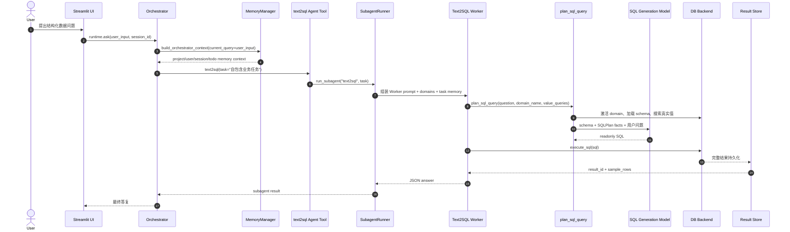

# Text2SQL 调用链与 Prompt 审查

> 本文记录一次泛化后的 Text2SQL 调用链审查方法。为了避免暴露具体业务数据，文中只使用抽象 domain、实体和值。

## 总体结论

当前链路已经收敛为两层结构：

- Orchestrator 负责理解用户意图、选择 `text2sql` subagent、汇总最终答复。
- Text2SQL Worker 只暴露 `plan_sql_query` 和 `execute_sql` 这类高层工具。
- Domain 激活、Schema 装载、Value Linking、SQLPlan 构造、SQL 生成都下沉到 Worker 后端脚本中，不作为细粒度工具逐个暴露给 Orchestrator。
- 查询结果通过 Result Store 持久化，模型只拿到 `result_id`、`row_count` 和少量 `sample_rows`。

## 调用链总览

## 审查重点

### 1. Orchestrator 不应越权补 schema

Orchestrator 委派给 subagent 的 task 应保持业务自然语言表达。除非用户原文明确提供字段名或 SQL 条件，否则不要写入 schema 字段名、枚举值或 SQL-like 过滤表达式。

### 2. SQLPlan 只保留事实

`SQLPlan` 应只承载可追溯事实，例如：

- `question`
- `domain`
- `table`
- `selected_columns`
- `selected_schema`
- `linked_values`
- `business_metrics`
- `constraints`

不要重新加入由 Python 关键词推断出的 `metric_intent`、`limit`、`display_intent`、`time_filters`、`confidence` 或 `assumptions`。

### 3. business_metrics 是参考事实，不是代码硬约束

`DOMAIN.md` 可以声明业务口径，但代码不应通过子串匹配直接注入过滤条件。SQL 模型应根据用户问题、schema、linked values 和 business metrics 自主判断是否适用。

### 4. 空结果诊断应与最终答案分离

Worker 可以在 trace 中记录诊断查询，但最终答复应区分：

- 直接回答用户问题的结论。
- 为排查空结果或歧义而做的补充诊断。

### 5. Memory 命中需要可审计

如果记忆会影响业务口径，诊断界面应展示：

- 命中的 namespace。
- 检索策略。
- 命中条数。
- 注入摘要。

只要 task、linked values、business metrics、SQL 和 result_id 都可追溯，Text2SQL 链路就不容易退化成 benchmark-style prompt 过拟合。
