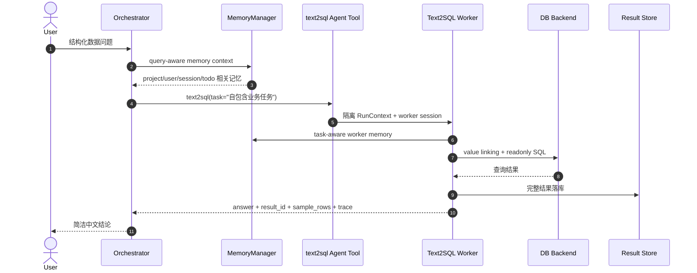

# 从纯工具式 Text2SQL 到 Subagent + Memory 架构

> 本文记录当前架构相对早期 `main` 形态的设计升级。README 只描述当前架构；历史对比放在这里。

## 背景

早期版本的 Text2SQL 更接近“纯工具调用”形态：主编排模型直接围绕一组本地工具完成 domain/schema/value/SQL/execute 流程。这个方式能跑通问数，但数据库问答逻辑和主会话上下文耦合较紧：

- 主模型容易同时背负用户沟通、schema 理解、SQL 试错、执行结果总结。
- SQL 生成过程中的噪音会进入主会话历史，长对话里更容易污染后续判断。
- 记忆、结果隔离、诊断展示很难按职责分层扩展。
- 新增专业能力时，容易继续往 Orchestrator 暴露更多细粒度工具。

当前版本把 Text2SQL 抽象为独立 subagent，并增强 Memory 与诊断能力，使主编排器更像“任务路由与结果汇总层”，而不是直接执行 SQL 的工具调度器。

## 架构对比

| 维度 | 早期纯工具式 Text2SQL | 当前 Subagent + Memory 架构 |
|------|----------------------|-----------------------------|
| 主模型职责 | 直接选择并调用 Text2SQL 细粒度工具 | 只判断是否委派 `text2sql`，并汇总结果 |
| Text2SQL 执行位置 | 主编排上下文内 | 独立 Worker RunContext + 内存 SQLiteSession |
| 工具可见性 | 主模型容易看到 schema/value/SQL/execute 工具 | Orchestrator 只看到 `text2sql(task=...)` |
| Worker 工具面 | 容易暴露多步工具链 | Worker 只暴露 `plan_sql_query`、`execute_sql`、`get_current_time` |
| SQLPlan 职责 | 容易混入代码推断，如 metric/limit/display | 只承载事实：schema、linked_values、business_metrics、constraints |
| 业务口径 | 可能散落在 prompt 或代码规则里 | `DOMAIN.md` 声明，作为事实交给 SQL 模型判断 |
| Memory 注入 | 更偏全局或按最近记录加载 | query-aware 检索，按 Orchestrator/Worker 作用域注入 |
| 结果返回 | 容易把数据样例带回模型上下文 | Result Store 持久化完整结果，只返回 pointer + sample |
| 诊断 | 工具日志分散 | Model Calls、Execution、Memory、Result Store 分页统一展示 |

## 当前数据流

## 关键设计取舍

### 1. Orchestrator 只委派，不猜内部 schema

当前 prompt 要求 Orchestrator 只传递用户原文和已确认事实，不替 subagent 推断 schema 字段、枚举值或 SQL 条件。这样可以避免主模型在不了解 domain schema 的情况下写出 `room_name='403'` 这类 schema-like task。

### 2. Text2SQL 保留高层工具，但删除代码推断层

Worker 仍采用 `plan_sql_query -> execute_sql` 的两阶段工具面，避免回到冗长的 7 步工具链。但 `planning.py` 不再用 Python 关键词推断 metric、limit、display、time、confidence 或 assumptions。

`SQLPlan` 现在是事实载体：

- `question`
- `domain`
- `table`
- `selected_columns`
- `linked_values`
- `business_metrics`
- `constraints`

SQL 模型根据这些事实自行决定 SELECT、COUNT、GROUP BY、ORDER BY 和 LIMIT。

### 3. business_metrics 是 domain 事实，不是代码硬约束

`DOMAIN.md` 可以声明业务口径，例如“可用机柜”对应哪些字段和值。但代码不对子串做硬匹配，也不直接把某个 metric 注入为过滤条件。这样能避免“不是空闲的机柜”这类否定语义被简单子串匹配误伤。

### 4. Memory 按作用域适配

Memory 不再只是按时间截断注入。当前支持：

- Orchestrator 使用当前用户问题做 query-aware 检索。
- Worker 使用 subagent task 做 task-aware 检索。
- `project`、`user`、`skill:text2sql` 等 namespace 分层注入。
- Embedding 可用时走向量检索，不可用时退回词法/最近记录。
- 前端可关闭 Memory 或清空记忆数据库。

### 5. 结果与诊断分离

完整 SQL 结果写入 `agent_results.sqlite`，模型只接收 `result_id`、`row_count` 和样例行。诊断日志写入 `.streamlit_agent_sessions.sqlite`，前端按 Model Calls、执行过程、Memory Events 和 Results 分页展示。

## 用户可见收益

- 简单查询的主模型上下文更干净。
- SQL 试错不会污染 Orchestrator 会话历史。
- 查询结果大时不会撑爆模型上下文。
- 项目口径和用户偏好可以跨会话复用。
- 执行过程可审计：能看到 memory 命中、domain 激活、value linking、SQLPlan facts、SQL 和 result_id。

## 后续方向

- 继续减少 Worker 编排模型的空转调用，例如评估固定 plan/execute 后只让模型总结。
- 对 business_metrics 做更好的 prompt 展示压缩，而不是在代码中硬匹配。
- 增加更多回归场景，尤其是含否定语义、模糊实体和用户纠正口径的多轮问答。
